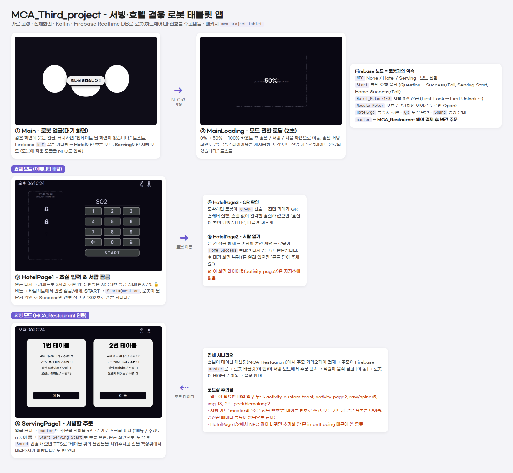
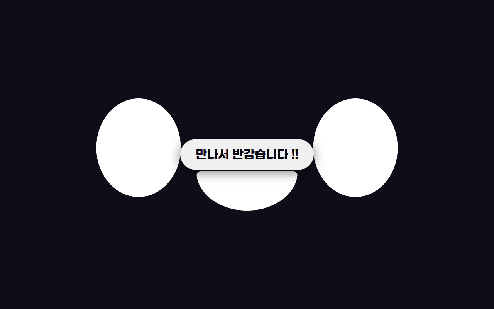
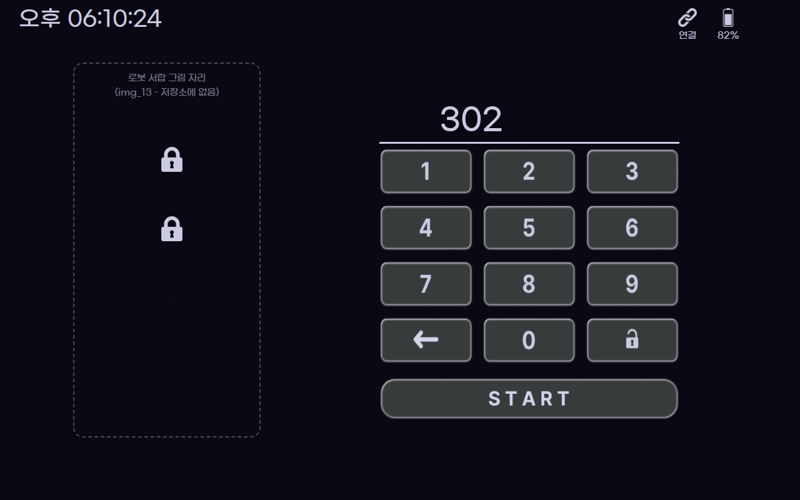
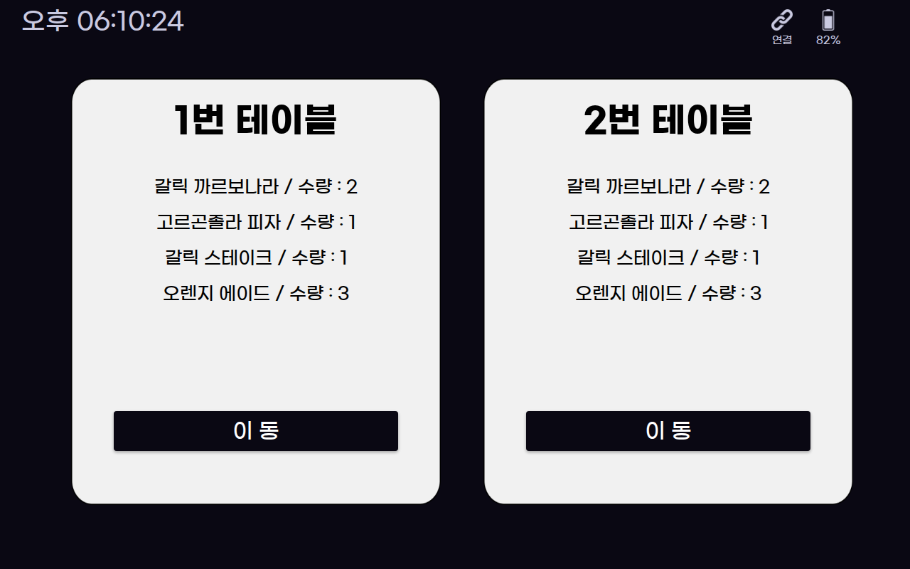

# MCA Third Project – 서빙·호텔 겸용 로봇 태블릿 앱

로봇 몸체에 장착하는 **가로형 Android 태블릿 앱**입니다.
로봇에 끼운 모듈(NFC 태그)에 따라 **서빙 모드**와 **호텔(객실 물품 배달) 모드**로 바뀌고,
로봇 하드웨어와는 **Firebase Realtime Database** 값을 주고받으며 동작합니다.

서빙 모드는 테이블 주문 앱 [MCA_Restaurant](https://github.com/ChoIT97/MCA_Restaurant)와 연동됩니다.
손님이 테이블 태블릿에서 결제한 주문이 Firebase `master` 노드에 저장되면, 이 앱이 그 주문을 서빙할 목록으로 보여줍니다.



> 화면 이미지는 레이아웃 XML과 저장소의 리소스로 재현한 것입니다. 실제 기기 화면과 조금 다를 수 있습니다.

---

## 화면 구성

| 로봇 얼굴(대기) | 호실 입력 (호텔) | 서빙할 주문 (서빙) |
|---|---|---|
|  |  |  |

### 공통
| 화면 | 클래스 | 설명 |
|---|---|---|
| 대기 화면 | `Main` | 로봇 얼굴만 표시합니다. `NFC` 값이 `Hotel` 또는 `Serving`으로 바뀌면 로딩 화면을 거쳐 해당 모드로 이동합니다. |
| 로딩 화면 | `MainLoading` | 2초 동안 0% → 100%를 표시한 뒤 `key1` 값(`0` 대기, `1` 호텔, `2` 서빙)에 맞는 화면으로 이동합니다. |

### 호텔 모드 (객실 물품 배달)
1. **`HotelMain`**: 얼굴 화면입니다. 터치하면 호실 입력 화면으로 이동합니다.
2. **`HotelPage1`**: 키패드로 3자리 호실을 입력합니다. 왼쪽에는 서랍 3칸의 잠금 상태가 실시간으로 표시되고, 🔓 버튼을 누르면 칸별 잠금/해제 바텀시트(`BottomSheetFragment`)가 열립니다.
   - **START**를 누르면 `Start=Question`을 보내고 로봇의 응답을 기다립니다. `Fail`이면 "문을 닫아 주세요"를 띄우고, `Success`이면 서랍을 모두 잠근 뒤 `Hotel/go`에 호실을 저장하고 출발합니다.
3. **`HotelPage3`**: 이동하는 동안 얼굴 화면을 보여줍니다. 도착하면 로봇이 `QR=QR`을 보내고, 앱은 전면 카메라 QR 스캐너를 실행합니다. 스캔한 값이 입력한 호실과 같으면 다음 화면으로 넘어갑니다.
4. **`HotelPage2`**: 열어야 할 서랍 칸의 잠금을 풉니다. 손님이 물건을 꺼낸 뒤 로봇이 `Home_Success`를 보내면 서랍을 다시 잠그고 `HotelMain`으로 돌아갑니다.

### 서빙 모드 (MCA_Restaurant 연동)
1. **`ServingMain`**: 얼굴 화면입니다. 터치하면 주문 목록으로 이동합니다. 로봇이 테이블에 도착해 `Sound=Sound`를 보내면 TTS로 다음 안내를 두 번 읽습니다.
   > "테이블 위의 물건들을 치워주시고 손을 책상위에서 내려주시기 바랍니다."
2. **`ServingPage1`**: `master`에 저장된 주문을 테이블 카드로 가로 스크롤해 보여줍니다. **이 동** 버튼을 누르면 `Start=Serving_Start`를 보내 로봇을 출발시키고 얼굴 화면으로 돌아갑니다.

---

## Firebase Realtime Database 구조

이 앱과 로봇 하드웨어는 아래 노드의 값을 주고받으며 동작합니다.

| 노드 | 값 | 쓰는 쪽 → 읽는 쪽 | 의미 |
|---|---|---|---|
| `NFC` | `None` / `Hotel` / `Serving` | 로봇 → 앱 | 장착된 모듈에 따른 모드 전환 |
| `Start` | `Question` → `Success` / `Fail` | 앱 ↔ 로봇 | 호텔 출발 요청과 응답 (문 닫힘 확인) |
| | `Question1`, `Home_Success` / `Home_Fail` | 앱 ↔ 로봇 | 배달 완료 후 복귀 요청과 응답 |
| | `Serving_Start` | 앱 → 로봇 | 서빙 출발 |
| `Hotel_Motor/Hotel_Motor1~3` | `First_Lock` ↔ `First_Unlock` (`Second_…`, `Third_…`) | 앱 ↔ 로봇 | 서랍 3칸 잠금 모터 |
| `Module_Motor` | `Open` | 앱 → 로봇 | 모듈 결속 해제 (상단 체인 아이콘) |
| `Hotel/go` | 호실 번호 (예: `302`) | 앱 | 배달 목적지 |
| `Hotel/Lock1~3` | `…_Unlock` | 앱 | 도착 후 열어야 할 서랍 칸 |
| `QR` | `QR` | 로봇 → 앱 | 도착 신호 (QR 스캔 시작) |
| `Sound` | `Sound` | 로봇 → 앱 | 서빙 도착 신호 (음성 안내) |
| `master` | `[{meatMenu, meatNumber, meatValue}, …]` | MCA_Restaurant → 앱 | 결제가 끝난 주문 목록 |

---

## 프로젝트 구조

```
app/src/main/java/com/chocho/mca_project_tablet/
├── Main.kt                    # 대기 화면 (앱 시작점, NFC로 모드 결정)
├── MainLoading.kt             # 모드 전환 로딩 화면
├── HotelMain.kt               # 호텔 - 얼굴 화면
├── HotelPage1.kt              # 호텔 - 호실 입력 / 출발 / 서랍 잠금 표시
├── BottomShetFragment.kt      # 호텔 - 서랍 칸별 잠금/해제 바텀시트
├── HotelPage3.kt              # 호텔 - 도착 후 QR 확인
├── HotelPage2.kt              # 호텔 - 서랍 열기 / 복귀
├── ServingMain.kt             # 서빙 - 얼굴 화면 + TTS 안내
├── ServingPage1.kt            # 서빙 - 서빙할 주문 목록 (시간·배터리 상태바)
├── ServingAdapter.kt          # 서빙 - 테이블 카드 어댑터
├── ServingAdapterFirebase.kt  # 서빙 - 카드 안의 "메뉴 / 수량" 목록 어댑터
├── SubViewModel.kt            # 서빙 - 주문 LiveData 전달
├── Table1ActivityRepo.kt      # master 노드 구독
├── Table2ActivityRepo.kt      # master 노드 구독 (현재 미사용)
└── Meat.kt                    # 주문 항목 데이터 (메뉴명, 수량, 금액)
```

## 기술 스택
- Kotlin, Android (compileSdk 33 / **minSdk 30**), 가로 고정 · 전체화면
- Firebase Realtime Database
- AndroidX ViewModel · LiveData, RecyclerView, Material BottomSheet
- [zxing-android-embedded](https://github.com/journeyapps/zxing-android-embedded) (QR 스캔), Glide (GIF), Android TextToSpeech

## 실행 방법
1. Android Studio에서 프로젝트를 엽니다.
2. `app/google-services.json`을 자신의 Firebase 프로젝트 설정 파일로 교체합니다. MCA_Restaurant와 **같은 Firebase 프로젝트**를 써야 주문이 연동됩니다.
3. 아래 **누락된 리소스**를 추가한 뒤 빌드합니다.
4. 로봇 없이 테스트하려면 Firebase 콘솔에서 위 표의 값을 직접 바꿉니다. 예: `NFC`를 `Serving`으로 바꾸면 서빙 모드로 전환됩니다.

---

## 알려진 문제

### 누락된 리소스 (그대로는 빌드되지 않음)
코드가 참조하지만 저장소에 없는 파일입니다.
- `res/layout/activity_custom_toast.xml` (`toast_layout_root`, `textboard` id 포함): 모든 화면의 커스텀 토스트
- `res/layout/activity_page2.xml` (`lock6`~`lock8` id 포함): `HotelPage2` 화면
- `res/raw/spiner5`: 로딩 애니메이션
- `res/drawable/img_13`: 호실 입력 화면과 바텀시트의 로봇 서랍 그림
- `res/font/geekblemalang2`: 로딩 텍스트 폰트

### 동작상의 문제
- **서빙 카드가 테이블별로 나뉘지 않습니다.** `master`의 키는 테이블 번호가 아니라 주문 항목 순번(0, 1, 2…)입니다. 그래서 주문 개수만큼 "1번/2번/3번 테이블" 카드가 생기고, 모든 카드가 같은 전체 목록을 보여줍니다. 또 `keyList`를 비우지 않아 데이터가 갱신될 때마다 카드가 중복으로 늘어납니다.
- **`HotelPage1`, `HotelPage2`에서 NFC 값이 바뀌면 앱이 종료됩니다.** 이 두 화면에서는 `intentLoding`이 초기화되지 않기 때문입니다.
- **`HotelPage1`에서 START 없이 화면을 떠나면 `onStop`에서 앱이 종료될 수 있습니다.** `startListener`가 초기화되지 않은 상태로 리스너 해제를 시도하기 때문입니다.
- **상태바 갱신 주기가 너무 짧습니다.** 시간·배터리를 10ms마다 갱신해서 불필요하게 자주 호출됩니다.
- **`MainLoading.startCountdown`의 화면 이동 분기는 실행되지 않습니다.** 분기는 `None`/`Hotel`/`Serving` 값을 기다리는데, 실제로 넘어오는 값은 `0`/`1`/`2`입니다. 실제 화면 이동은 `Handler`가 처리합니다.
